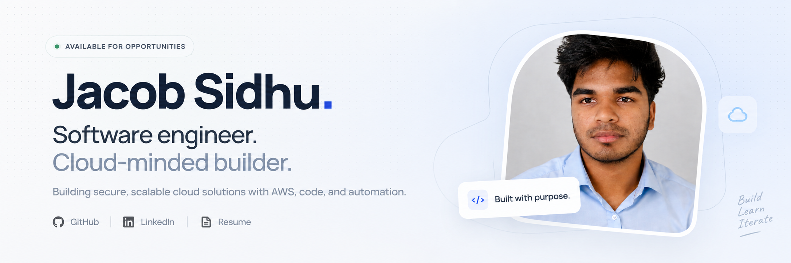
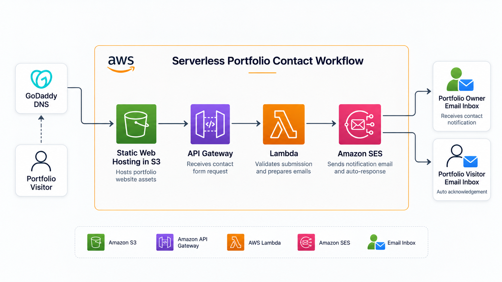
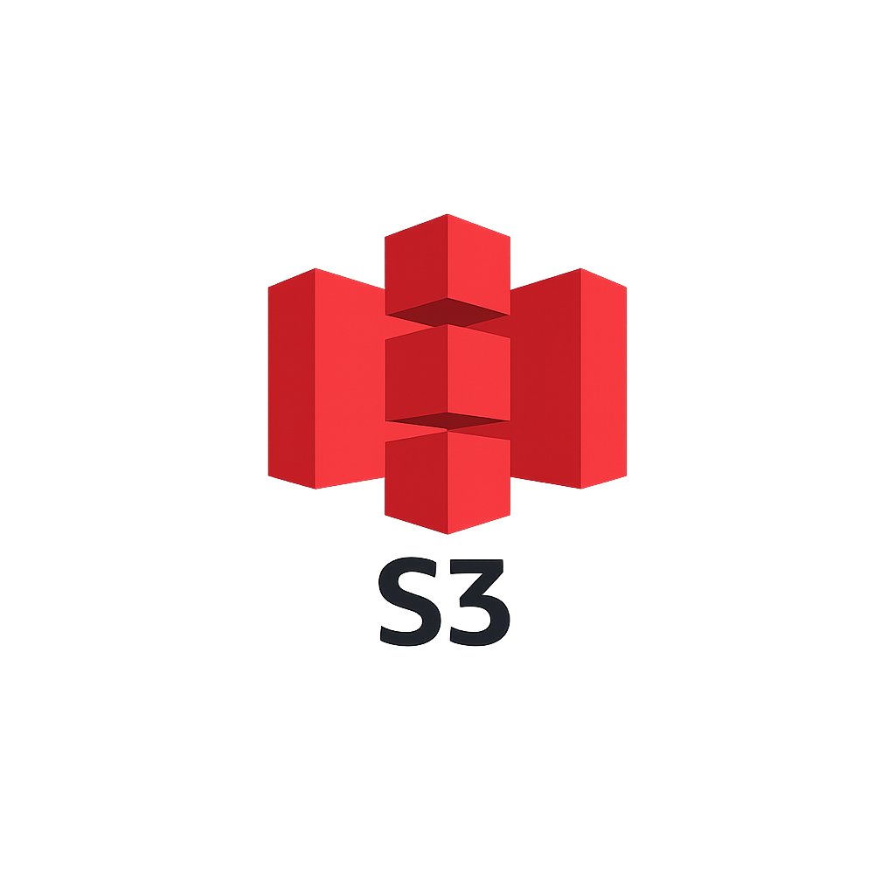
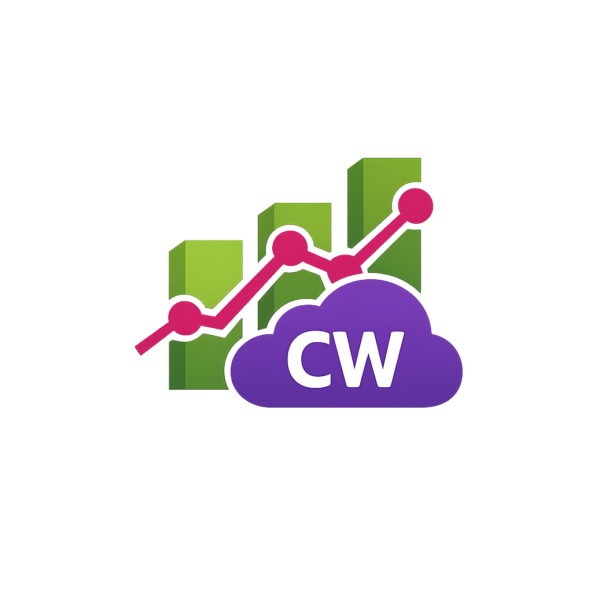

<p align="center">
  
</p>

<p align="center">
  <strong>Serverless portfolio platform on AWS, provisioned with Terraform.</strong>
  <br />
  <sub>Vite · Amazon S3 · API Gateway · Lambda · Node.js · GitHub Actions</sub>
</p>

<p align="center">
  <a href="https://www.jacobsidhu.com"><strong>Live site ↗</strong></a>
  &nbsp;&nbsp;·&nbsp;&nbsp;
  <a href="#architecture">Architecture</a>
  &nbsp;&nbsp;·&nbsp;&nbsp;
  <a href="#running-locally">Run locally</a>
  &nbsp;&nbsp;·&nbsp;&nbsp;
  <a href="https://www.linkedin.com/in/jacobsidhu">LinkedIn ↗</a>
</p>

---

## Overview

This repository contains my personal portfolio and the infrastructure used to
host it on AWS.

It is more than a static résumé. The project demonstrates frontend
development, infrastructure as code, serverless API design, validation,
least-privilege IAM, remote Terraform state, and CI/CD fundamentals.

### What this project demonstrates

- Responsive frontend built with HTML, CSS, JavaScript, and Vite
- Static website hosting with Amazon S3
- HTTP routing through Amazon API Gateway
- Serverless contact endpoint using AWS Lambda
- Owner notifications delivered through Amazon SES
- Input validation and bounded request fields
- Infrastructure managed through Terraform
- Remote Terraform state stored in S3
- Automated frontend builds and Terraform validation with GitHub Actions
- Optional custom domain and TLS certificate configuration

## Architecture

<p align="center">
  <a href="./public/assets/project-serverless-portfolio-architecture.png">
    
  </a>
  <br />
  <sub>Target contact workflow — click the diagram to open the full-size image.</sub>
</p>

### Target request flow

1. The visitor opens the custom domain.
2. GoDaddy DNS routes the visitor to the portfolio hosted in Amazon S3.
3. The browser loads the static assets generated by Vite.
4. A contact submission is sent through API Gateway to `POST /contact`.
5. API Gateway invokes the Node.js Lambda function.
6. Lambda validates the submission and prepares the email payloads.
7. Amazon SES sends the validated message to the portfolio owner's inbox.

> [!IMPORTANT]
> The owner-notification path is implemented. The visitor acknowledgement shown
> in the target diagram remains planned and should only be enabled after adding
> stronger bot and abuse protection.

## Technology stack

| | Layer | Implementation | Engineering purpose |
|:---:|---|---|---|
|  | **Frontend** | HTML, CSS, JavaScript, Vite | Responsive portfolio UI and production asset builds |
|  | **Hosting** | Amazon S3 | Durable, low-maintenance static website storage |
|  | **API** | API Gateway HTTP API | Managed website routing and `POST /contact` endpoint |
|  | **Compute** | AWS Lambda, Node.js 22 | On-demand validation without an always-on server |
|  | **TLS** | AWS Certificate Manager | Optional custom-domain certificate and TLS 1.2 policy |
|  | **Infrastructure** | Terraform | Reviewable and repeatable AWS provisioning |
|  | **Automation** | GitHub Actions | Frontend build and Terraform quality gates |
|  | **Observability** | CloudWatch Logs | Lambda execution records and troubleshooting |

## Features

- Project case studies with architecture diagrams
- Expandable project details and version history
- Skills and cloud technology catalogue
- Certification previews
- Contact form with client-side and server-side validation
- Keyboard-accessible dialogs
- Responsive layouts for desktop and mobile
- Long-lived cache headers for versioned static assets
- Automated infrastructure formatting and validation

## Repository structure

```text
portfolio/
├── .github/
│   └── workflows/               # CI and infrastructure workflows
├── backend/
│   └── lambda-functions/
│       └── contact/             # Contact API Lambda
├── infra/
│   ├── architecture/            # Architecture documentation
│   └── terraform/               # AWS infrastructure definitions
├── public/
│   └── assets/                  # Images, certificates, and icons
├── src/
│   ├── main.js                  # UI behaviour and contact integration
│   └── styles.css               # Application styles
├── index.html
├── package.json
└── README.md
```

## Running locally

### Prerequisites

- Node.js 22
- npm

### Installation

```bash
git clone https://github.com/JacobSidhu/portfolio.git
cd portfolio
npm ci
```

Create a `.env.local` file if you want to connect the contact form to a
deployed API:

```env
VITE_API_CONTACT_URL=https://your-api-id.execute-api.eu-west-2.amazonaws.com/contact
```

Start the development server:

```bash
npm run dev
```

Create a production build:

```bash
npm run build
```

Preview the production build:

```bash
npm run preview
```

## Infrastructure deployment

### Prerequisites

- Terraform 1.6 or later
- An AWS account
- AWS credentials with the required permissions
- A globally unique S3 website bucket name
- An existing S3 bucket for Terraform remote state

> [!WARNING]
> The checked-in Terraform backend references the owner's state bucket.
> Anyone deploying a fork must configure their own backend before running
> `terraform init`.

```bash
npm ci
npm run build

cd infra/terraform
terraform fmt -check
terraform init
terraform validate
terraform plan -var="portfolio_bucket_name=your-unique-bucket-name"
```

Review the plan carefully before applying it:

```bash
terraform apply -var="portfolio_bucket_name=your-unique-bucket-name"
```

Infrastructure destruction should be deliberate:

```bash
terraform plan \
  -destroy \
  -var="portfolio_bucket_name=your-unique-bucket-name"
```

## Design decisions

### Why S3?

The frontend is static and does not require a continuously running server.
S3 provides durable, low-maintenance storage and usage-based pricing.

### Why API Gateway HTTP API?

HTTP API provides a managed public endpoint without maintaining a reverse
proxy or application server. It also integrates directly with Lambda.

### Why Lambda?

The contact workload is short-lived and event-driven. Lambda avoids paying
for idle compute and scales independently of the frontend.

### Why Terraform?

Terraform makes the infrastructure reviewable, repeatable, and rebuildable.
The AWS configuration is versioned beside the application that consumes it.

### Why no database?

The current contact endpoint does not need persistent application state.
Adding a database would introduce cost and operational complexity without a
clear requirement.

## Cost assumptions and controls

This project is designed for low-volume portfolio traffic.

### Example planning assumptions

| Item | Planning assumption |
|---|---:|
| Page views | 10,000 per month |
| Contact submissions | 100 per month |
| Stored website assets | Under 500 MB |
| Deployment region | `eu-west-2` |
| Availability target | Best-effort portfolio workload |
| Monthly AWS target | Below $3, excluding domain registration |
| Budget alert | $5 per month |

The actual bill depends on asset size, request count, data transfer, logging,
region, taxes, and AWS account eligibility. The estimate should therefore be
validated with the
[AWS Pricing Calculator](https://calculator.aws/).

### Cost-management practices

- Serverless services avoid continuously running compute
- Static assets use long-lived browser cache headers
- Lambda performs only bounded request processing
- A monthly AWS Budget should alert at 50%, 80%, and 100% of the $5 threshold
- Resources should carry `Project`, `Environment`, and `Owner` tags
- CloudWatch log retention should be explicitly limited
- Cost Explorer should be reviewed after deployments
- Unused preview infrastructure should be destroyed promptly

See the official
[AWS Lambda pricing](https://aws.amazon.com/lambda/pricing/),
[API Gateway pricing](https://aws.amazon.com/api-gateway/pricing/), and
[AWS Budgets pricing](https://aws.amazon.com/aws-cost-management/aws-budgets/pricing/)
pages for current rates.

## Security considerations

### Implemented

- TLS 1.2 policy for the optional API Gateway custom domain
- Dedicated Lambda execution role
- Lambda role limited to basic CloudWatch logging
- Server-side email format and field-length validation
- Contact message bodies are not written to logs
- Infrastructure changes are reviewable as code
- Terraform formatting and validation run in CI

### Known limitations

- The S3 website bucket currently allows public object reads
- API Gateway CORS currently permits every origin
- The contact endpoint has no CAPTCHA, rate limit, or abuse protection
- GitHub Actions currently uses stored AWS access keys
- Automatic visitor acknowledgements are not yet enabled
- CloudWatch log retention is not explicitly configured
- The repository contains overlapping CI/deployment workflows

These limitations are documented intentionally so that this portfolio does
not present a learning implementation as a production-complete system.

## Assumptions

- The website serves public, non-sensitive content
- Traffic is relatively low and unpredictable
- Contact submissions contain no confidential information
- DNS is managed outside this Terraform configuration
- One AWS region is sufficient for this portfolio
- Brief downtime during a deployment is acceptable
- Cost and operational simplicity are prioritised over multi-region resilience

## Roadmap

- [x] Deliver contact messages through Amazon SES
- [ ] Add abuse-protected visitor acknowledgements
- [ ] Restrict CORS to the production domain
- [ ] Add API throttling and bot protection
- [ ] Replace long-lived AWS keys with GitHub OIDC
- [ ] Add CloudFront with Origin Access Control
- [ ] Make the S3 bucket private
- [ ] Add security headers and a Content Security Policy
- [ ] Configure CloudWatch log-retention periods
- [ ] Add an AWS Budget through Terraform
- [ ] Consolidate the CI and deployment workflows
- [ ] Add automated tests for the Lambda handler
- [ ] Add Lighthouse performance and accessibility checks

## What I learned

This project reinforced that deploying even a small static application
requires decisions beyond frontend code:

- Separating static content from dynamic API behaviour
- Managing infrastructure state safely
- Applying least privilege to service roles
- Understanding the difference between validation and message delivery
- Designing for low cost without hiding security trade-offs
- Keeping architecture diagrams aligned with deployed infrastructure
- Treating documentation as part of the engineering deliverable

## Author

**Jacob Sidhu**

Software engineer and cloud-minded builder focused on AWS, backend systems,
infrastructure as code, and automation.

- Website: [jacobsidhu.com](https://www.jacobsidhu.com)
- GitHub: [@JacobSidhu](https://github.com/JacobSidhu)
- LinkedIn: [linkedin.com/in/jacobsidhu](https://www.linkedin.com/in/jacobsidhu)
